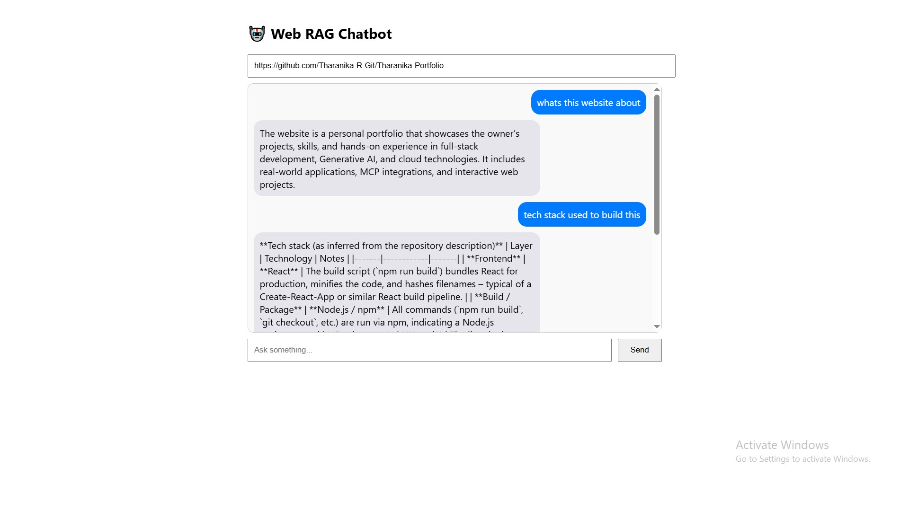

# 🕸️ Website RAG using Scrapling

A modular, production-ready **Retrieval-Augmented Generation (RAG)** backend that scrapes website content using [Scrapling](https://github.com/arthurpaiva96/scrapling), chunks and embeds the text, and answers questions with an LLM (Groq API). Comes with a React frontend for seamless QA over any website.

---

## 🌟 Features

- **Web Scraping:** Extract website content using Scrapling.
- **Text Chunking:** Efficiently splits large texts for better retrieval.
- **Embeddings & Vector Store:** Uses Sentence Transformers and FAISS for semantic search.
- **LLM Integration:** Leverages Groq API for context-grounded answers.
- **CORS-ready FastAPI Backend:** Plug-and-play with Next.js or React frontends.
- **React UI:** Quickstart frontend in `/web-rag-ui`.

---

## Output


## 🚀 Installation

### Backend (Python, FastAPI)

1. **Clone the Repository**
   ```bash
   git clone https://github.com/yourusername/Website-rag-using-scrapling.git
   cd Website-rag-using-scrapling
   ```

2. **Create Virtual Environment & Install Dependencies**
   ```bash
   python3 -m venv .venv
   source .venv/bin/activate
   pip install -r requirements.txt
   ```
   *(You may need to manually install: `fastapi`, `scrapling`, `sentence-transformers`, `faiss-cpu`, `python-dotenv`, `groq`)*

3. **Set up Environment Variables**
   - Copy `.env.example` to `.env` and add your [Groq API Key](https://console.groq.com/):
     ```
     GROQ_API_KEY=your_groq_api_key
     ```

4. **Run the Backend**
   ```bash
   uvicorn app:app --reload
   ```

### Frontend (React)

1. **Navigate to UI Folder**
   ```bash
   cd web-rag-ui
   ```

2. **Install Dependencies**
   ```bash
   npm install
   ```

3. **Start the Frontend**
   ```bash
   npm start
   ```
   Open [http://localhost:3000](http://localhost:3000) in your browser.

---

## 🛠️ Usage

1. **Start both backend and frontend** as above.
2. In the web UI, enter a target website URL and your question.
3. The backend will:
    - Scrape the website,
    - Chunk and embed the content,
    - Retrieve relevant context,
    - Generate an answer using the LLM.
4. The answer appears in the UI, sourced only from the provided site.

---

## 🤝 Contributing

Contributions are welcome! Please:

1. Fork the repo.
2. Create your feature branch: `git checkout -b feature/your-feature`
3. Commit your changes: `git commit -am 'Add new feature'`
4. Push to the branch: `git push origin feature/your-feature`
5. Open a Pull Request.

---

## 📄 License

This project is licensed under the MIT License. See the [LICENSE](LICENSE) file for details.

---

### 📂 Project Structure

```
.
├── app.py               # FastAPI entrypoint
├── scraper.py           # Web scraping logic with Scrapling
├── utils.py             # Text chunking utilities
├── embedder.py          # Embedding & vector store
├── llm.py               # LLM prompt & completion
├── web-rag-ui/          # React frontend
│   ├── package.json
│   └── ...
└── README.md
```

---

> **Built with ❤️ for accessible, modular, and production-ready RAG pipelines.**


## License
This project is licensed under the **MIT** License.

---
🔗 GitHub Repo: https://github.com/Tharanika-R-Git/Website-rag-using-scrapling
